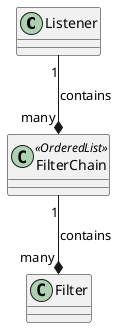

# Envoy

## Review Questions

- [README.md](./README.md) says Envoy is a data plane. What are the responsibilities of a data plane and what are the Envoy features that implement the data plane's responsibilities?
- What is a _host_? What is a _downstream host_ and an _upstream host_?
- What is a _listener_?
- What is a _cluster_?
- What is a _mesh_?
- What is Envoy's threading model?

## Terminology

A **host**:
- Is an **application**.
  - Can be a regular program/application.
  - Can be another Envoy proxy.
- Can do **network communication**.
- Has its own **network address**.
- A (physical or virtual) machine can contain one or more hosts.

A **downstream host**:
- Connects to Envoy.
- **Sends** a request.
- **Receives** a response.

An **upstream host**:
- Connects to Envoy.
- **Receives** a request.
- **Sends** a response.

A **listener**:
- Is a piece of software module.
- Is associated with a named network address (e.g., port, unix domain socket).
- Listens to incoming requests from the downstream hosts.
- Can be connected by the downstream hosts.

A **cluster**:
- Is a group of **upstream** hosts.
- These upstream hosts are **logically similar** so they can provide interchangeable services.
- Its members are discovered via _service discovery_.
- Its health is checked by _active health checking_.
- Envoy uses load balance policy to decide which member to route a request to.

> **Mesh**: A group of hosts that coordinate to provide a consistent network topology. In this documentation, an "Envoy mesh" is a group of Envoy proxies that form a message passing substrate for a distributed system comprised of many different services and application platforms.

> **Runtime configuration**: Out of band realtime configuration system deployed alongside Envoy. Configuration settings can be altered that will affect operation without needing to restart Envoy or change the primary configuration.

## Threading Model

Envoy uses a **single process with multiple threads**:
- One **coordination** thread (as the primary thread).
- A number of **worker** threads that do actual work: listening, filtering, forwarding.

> Once a connection is accepted by a listener, the connection spends the rest of its lifetime bound to a single worker thread. This allows the majority of Envoy to be **largely single threaded**.

> all worker threads independently attempt to accept connections on each listener and rely on the kernel to perform adequate balancing between threads.

## Listeners

Envoy configuration supports any number of listeners within a single process.

Generally we recommend running **a single Envoy per machine** regardless of the number of configured listeners.

Envoy supports two types of listeners:
- TCP
- UDP

## Listener filters

Envoy's listener filters may be used to manipulate **connection metadata**.

The main purpose of listener filters are to make adding further system integration functions easier by not requiring changes to Envoy core functionality, and also to make interaction between multiple such features more explicit.

### Filter chain

Network filters are chained in an ordered list of `FilterChain`.

## Example

```plantuml
@startyaml
static_resources:
  listeners:
    - name: listener_https
      address:
        socket_address:
          protocol: TCP
          address: 0.0.0.0
          port_value: 443
      listener_filters:
        - name: envoy.filters.listener.tls_inspector
          typed_config:
            @type: type.googleapis.com/envoy.extensions.filters.listener.tls_inspector.v3.TlsInspector
      filter_chains:
        - filter_chain_match:
            server_names:
              - acme.com
          transport_socket:
            name: envoy.transport_sockets.tls
            typed_config:
              @type: type.googleapis.com/envoy.extensions.transport_sockets.tls.v3.DownstreamTlsContext
              common_tls_context:
                tls_certificates:
                  - certificate_chain:
                      filename: certs/servercert.pem
                    private_key:
                      filename: certs/serverkey.pem
          filters:
            - name: envoy.filters.network.http_connection_manager
              typed_config:
                @type: type.googleapis.com/envoy.extensions.filters.network.http_connection_manager.v3.HttpConnectionManager
                stat_prefix: ingress_http
                use_remote_address: true
                http2_protocol_options:
                  max_concurrent_streams: 100
                access_log:
                  - name: envoy.access_loggers.file
                    typed_config:
                      @type: type.googleapis.com/envoy.extensions.access_loggers.file.v3.FileAccessLog
                      path: /var/log/envoy/access.log
                route_config:
                  name: local_route
                  virtual_hosts:
                    - name: local_service
                      domains:
                        - acme.com
                      routes:
                        - match:
                            path: /foo
                          route:
                            cluster: some_service
                http_filters:
                  - name: envoy.filters.http.router
                    typed_config:
                      @type: type.googleapis.com/envoy.extensions.filters.http.router.v3.Router
  clusters:
    - name: some_service
      transport_socket:
        name: envoy.transport_sockets.tls
        typed_config:
          @type: type.googleapis.com/envoy.extensions.transport_sockets.tls.v3.UpstreamTlsContext
      load_assignment:
        cluster_name: some_service
        endpoints:
          - lb_endpoints:
              - endpoint:
                  address:
                    socket_address:
                      address: 10.1.2.10
                      port_value: 10002
              - endpoint:
                  address:
                    socket_address:
                      address: 10.1.2.11
                      port_value: 10002
      typed_extension_protocol_options:
        envoy.extensions.upstreams.http.v3.HttpProtocolOptions:
          @type: type.googleapis.com/envoy.extensions.upstreams.http.v3.HttpProtocolOptions
          explicit_http_config:
            http2_protocol_options:
              max_concurrent_streams: 100
    - name: some_statsd_sink
stats_sinks:
  - name: envoy.stat_sinks.statsd
    typed_config:
      @type: type.googleapis.com/envoy.config.metrics.v3.StatsdSink
      tcp_cluster_name: some_statsd_sink
@endyaml
```

