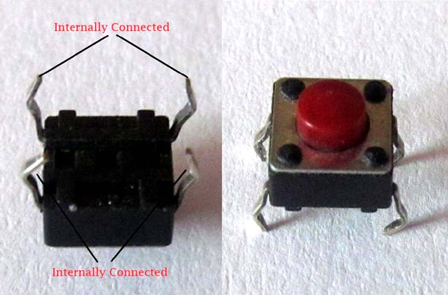
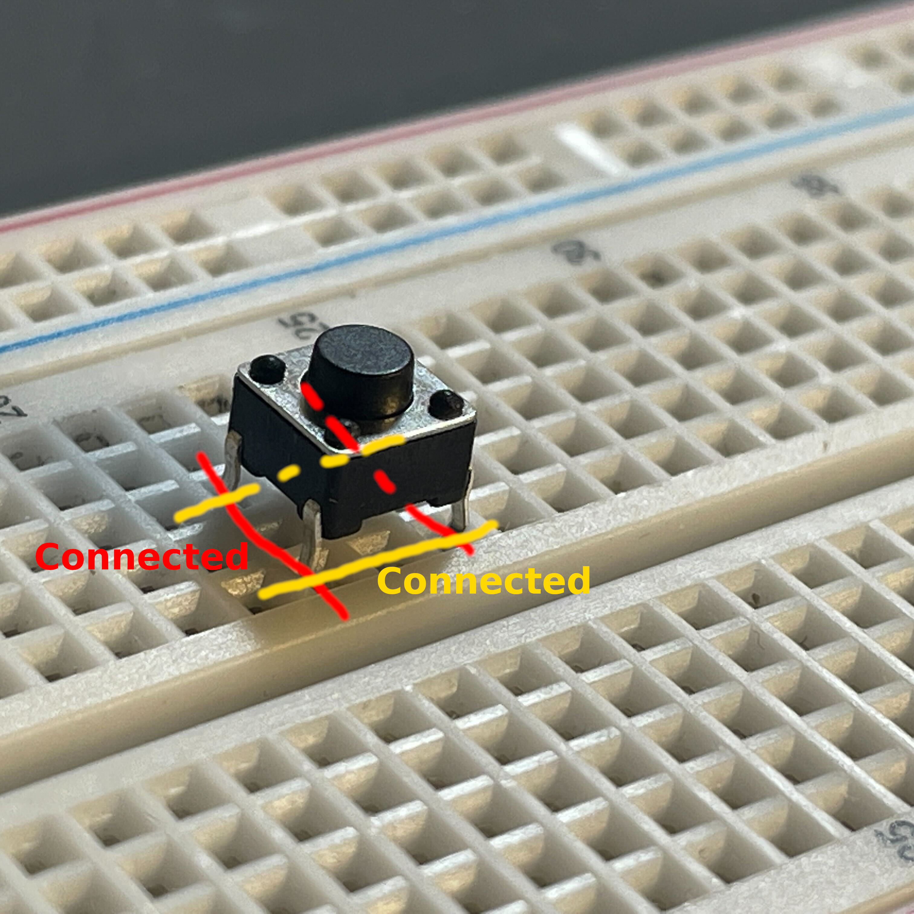
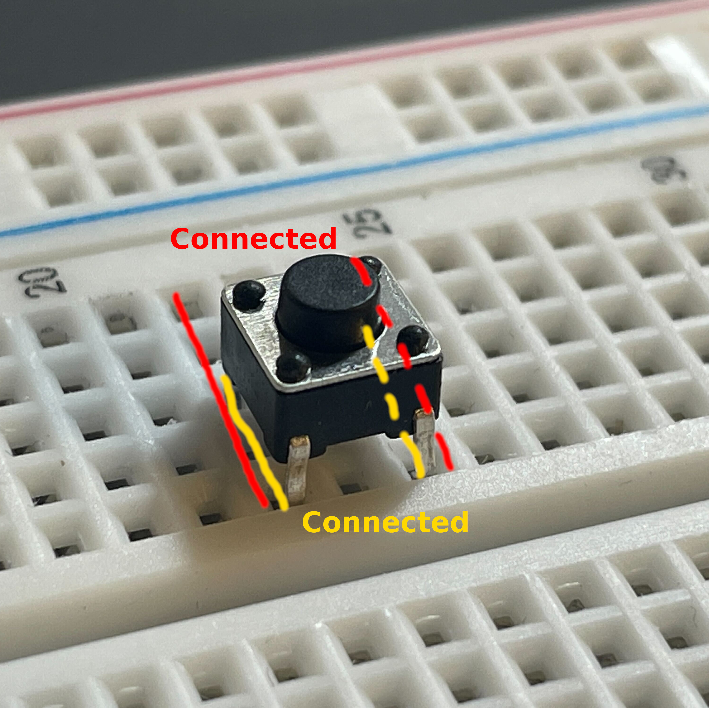

# Button

When using a push button on a breadboard, you must be careful to put the button at the correct orientation. I'll talk more what I mean below.

A push button has four legs. The following figure (from [here](https://circuitdigest.com/electronic-circuits/push-button-led-circuit)) shows how the legs are internally connected:

Therefore, if you put the button in the way of the following figure:

You are essentially connecting the two red rails using the internally connected legs that are marked in yellow. As a result, the two red rails now become "one rail".

You should put the button in the way of the following figure:

In this way, the internally connected legs are put on the same rail, so the two rails are still disconnected by the push button. Only when the push button is pressed down will the two red rails be connected.
