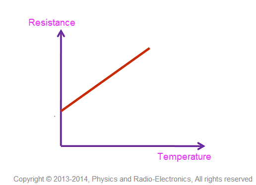
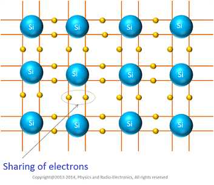
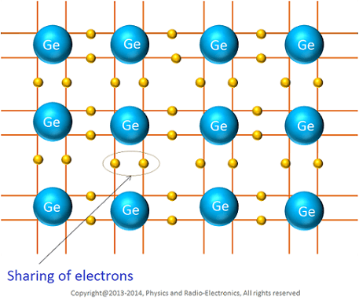
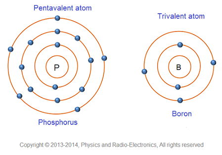
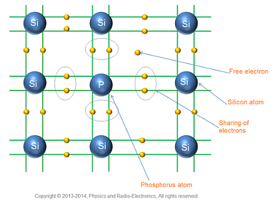
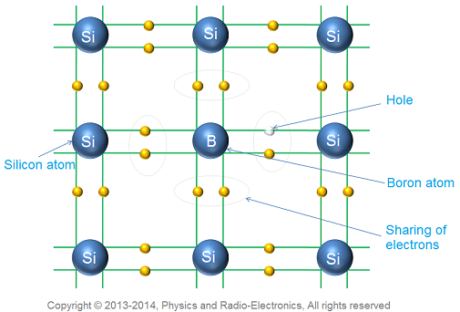
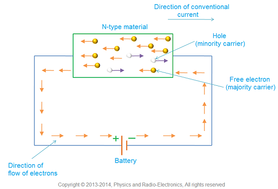
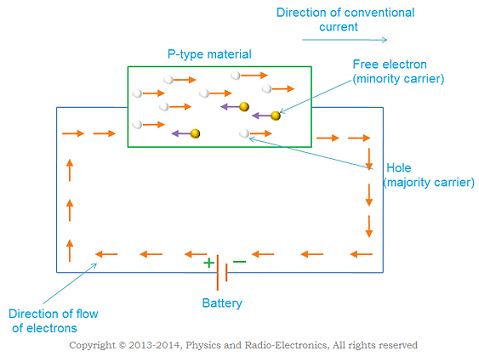
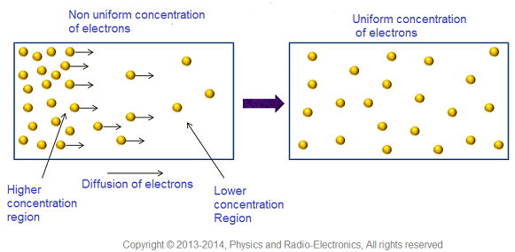
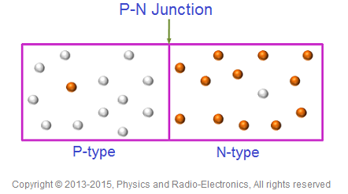

# Electronics Devices and Circuits

## 1. Overview

The notes in this document does not mean to teach physics, chemistry, and electrical engineering. Instead, I use them to quickly refresh my memory of the related topics, so the things that I have learned and understood (back in middle school) are not recorded here.

I referred to [Physics and Radio Electronics: Electronics devices and circuits](https://www.physics-and-radio-electronics.com/electronic-devices-and-circuits.html) when I studied the related topics. The figures, unless specified otherwise, all belong to the website. Many thanks to the site author(s)!

The notes start with atomic physics which is fundamental to understand electronics devices and circuits.

## 2. Atoms

An atom consists of three particles:

| Particle | Charge |
|---------:|:-------|
| electron | negative (-) |
| proton | positive (+) |
| neutron | neutral |

Protons and neutrons are bound together by the [strong nuclear force](https://www.physics-and-radio-electronics.com/physics/natural-forces/strong-nuclear-force.html) and form **nucleus**.

### 2.1 Electrons

An atom may have multiple electrons. The electrons revolve around the nucleus in different orbits.

The electrons on the same orbit have the same amount of energy. Electrons on different orbits have different amounts of energy.

For orbit n, the maximum capacity of electrons is `2*n^2`. For example,

| Orbit | Max capacity |
|:-----:|:-------------|
| n = 1 | $ 2 \cdot n^2 = 2 \cdot 1^2 = 2 $ |
| n = 2 | $ 2 \cdot n^2 = 2 \cdot 2^2 = 8 $ |
| n = 3 | $ 2 \cdot n^2 = 2 \cdot 3^2 = 18 $ |

**Exception**: The outermost orbit can hold at most `8` electrons.

The [**octet rule**](https://en.wikipedia.org/wiki/Octet_rule) states that atoms with 8 electrons in their outermost orbit are stable. Therefore, atoms have the tendency to get to this stable state. This tendency is also the foundation of the chemical bonding that will be discussed below. Also see [this question](https://chemistry.stackexchange.com/q/1196).

Every orbit has a fixed energy level associated with it:

| Electrons | Energy level | Nucleus attraction |
|:---------:|:------------:|:------------------:|
| Innermost orbit | Lowest | Strongest |
| Outermost orbit | Highest | Weakest |

Valence electrons: The electrons on the outmost orbit are called **valence electrons**.

Free electrons:  The electrons that are not attached to the nucleus and free to move when external energy is applied are called **free electrons**.

### 2.2 Mass number

Compared to protons and neutrons, an electron's mass is about 1830 times smaller, hence negligible.

| Term | Symbol | Description |
|-----:|:------:|:------------|
| Atomic number | `Z` | The number of protons in the nucleus of an atom. |
| Neutron number | `N` | The number of neutrons in the nucleus of an atom. |
| Mass number | `A` (= Z + N) | The total number of protons and neutrons in the nucleus of an atom. |

## 3 Ionization

Ionization is the process that an atom loses or gains electrons.

The result ion is not electrically neutral. Instead, it has either positive or negative charges. Respectively, they are called the positive ions or negative ions.

## 4 Chemical bond

The attractive forces between the atoms/ions that make them stick together are called **chemical bonds**.

There are three types of chemical bonds:
- 1). Covalent bond (共价键)
- 2). Ionic bond (离子键)
- 3). Metallic bond (金属键)

### 4.1 Covalent bond

When two atoms that don't have 8 electrons in the outermost orbit come close, some of the valence electrons of one atom can be attracted by the nucleus of the other atom. This attraction force makes the two atoms stick together and share some valence electrons. This sharing makes the outermost orbits of both atoms have 8 electrons, a stable state. This attraction force is called covalent bonding. See the following figure ([original link](https://www.physics-and-radio-electronics.com/electronic-devices-and-circuits/introduction/images/covalentbond.png)).

There are three ways to create a covalent bond:

| Bond type | Electrons shared | Illustration |
|:---------:|:----------------:|:------------:|
| Single bond | 2 |  |
| Double bond | 4 |  |
| Triple bond | 6 |  |

### 4.2 Ionic bond

Atoms can also reach the stable state by losing or gaining valence electrons. When an atom loses valence electrons, it becomes a positive ion; when an atom gains valence electrons, it becomes a negative ion. The oppositely charged ions attract each other and the attraction force makes them stick together. This force is called the ionic bonding. See the following fiture ([original link](https://www.physics-and-radio-electronics.com/electronic-devices-and-circuits/introduction/images/ionicbonds.png)).

### 4.3 Metallic bond

Metal atoms cannot form a covalent bond with the neighboring atoms, as described [here](https://www.physics-and-radio-electronics.com/electronic-devices-and-circuits/introduction/metallicbond.html):

> In metals, each atom has 8 or 12 neighboring atoms surrounding them and the valence electrons in the metal atoms are less than four. Hence, it is not possible for the metal atoms to form 8 or 12 covalent bonds with the neighboring atoms because they do not have such large number of valence electrons to form covalent bonding with the 8 or 12 neighboring atoms. Thus, metal atoms cannot form a covalent bond with the neighboring atoms.

(Frankly speaking, I still don't get it after reading the paragraph above, but I'll defer the understanding to the future and accept the conclusion for now. Also see [Metallic Bonding](https://chem.libretexts.org/Bookshelves/Physical_and_Theoretical_Chemistry_Textbook_Maps/Supplemental_Modules_(Physical_and_Theoretical_Chemistry)/Chemical_Bonding/Fundamentals_of_Chemical_Bonding/Metallic_Bonding).)

Metallic bond is formed in the metal due to the electrostatic force of attraction between the positive ions and the free electrons. See the following figure ([original link](https://www.physics-and-radio-electronics.com/electronic-devices-and-circuits/introduction/images/metallicbonding.jpg)).

## 5. Electron volt

Electron volt is the amount of energy one electron gains by moving through a potential difference of one volt:

$$
ev = (1.60217657 × 10^{-19} C) \cdot (1V) = 1.60217657 × 10^{-19} J
$$

For my own reference:
- `J` (joule) is the unit of energy.
- `W` (watt) is the unit of power (i.e., the rate of energy transfer). Therefore, $1W = 1J/s$.

## 6. Energy band theory in solids

### 6.1 Energy band

In a single isolated atom, the electrons on each orbit have definite energy associated with them. But in solids, because the atoms are close to each other, the energy levels of the **outermost electrons** are affected by the neighboring atoms. (Note that the energy levels of the electrons on the inner orbits are not affected much by the neighboring atoms.)

When two isolated atoms come close to each other, the electrons on the outermost orbit are attracted by the nucleus of the other atom. Some of them can be even shared by the two atoms. Because of this additional force, the energy levels of the electrons on the outermost orbit may not be the same anymore, but could be higher or lower than the original energy level.

Think about two `Cl` atoms. Each atom has 6 valence electrons. When these two atoms are far away enough, the energy level of the 6 valence electrons are the same. When the two atoms get close enough, they share 2 valence electrons to form a covalent bond. The energy level of the two shared electrons may be different from the other 4 electrons.

In other words, the electrons on the same orbit exhibit different energy levels. The grouping of different energy levels is called **energy band**.

Note that an energy band can contain **multiple energy levels** (hence the word "grouping").

### 6.2 Three important energy bands

There are a number of energy bands in solids but three of them are important to understanding the behaviors of solids:
- Valance band:
  - This band contains the the energy levels of the **valence electrons**.
  - The electrons in this band have lower energy than the electrons in the conduction band.
  - The electrons in this band are (loosely) bound to the atom's nucleus so they are **not free to move**.
- Conduction band:
  - This band contains the energy levels of the **free electrons**.
  - When external energy is applied to the electrons in the valence band, the electrons can jump into the conduction band and become free electrons.
  - Free electrons can move freely; free movement of electrons produces electricity. In other words, free electrons can conduct electricity, hence the name "conduction band".
  - Because the electrons in this band received external energy, they have higher energy than the electrons in the valence band.
  - The electrons in this band are **free to move**, so they are not bound to the atom's nucleus.
- Forbidden band (i.e., forbidden gap):
  - The forbidden band separates the valence band and the conduction band.
  - In solids, electrons cannot stay in the forbidden band because there are no allowed energy levels for the electrons, because electrons can "only take on certain discrete values of energy"(see [_Energy level_](https://en.wikipedia.org/wiki/Energy_level)).
  - Forbidden band is the major factor to classify solids as _insulators_, _semiconductors_, and _conductors_.

See the following figure ([original link](https://www.physics-and-radio-electronics.com/electronic-devices-and-circuits/introduction/images/energy-band-theory-in-solids.png)):

### 6.3 Insulators

The materials that have a large forbidden gap are called **insulators**. See the figure below ([original link](https://www.physics-and-radio-electronics.com/electronic-devices-and-circuits/introduction/images/insulator.png)). As a result, under normal conditions, the electrons in the valence band cannot jump into the conduction band. However, when a sufficiently large amount of energy is applied, the valence electrons can still gain enough energy to jump into the conduction band to conduct electricity. This is called [_electrical breakdown_](https://en.wikipedia.org/wiki/Electrical_breakdown).

### 6.4 Conductors

The materials in which the valence band and the conduction band overlap each other are called **conductors**. See the figure below ([original link](https://www.physics-and-radio-electronics.com/electronic-devices-and-circuits/introduction/images/conductor.png)). In other words, there is no forbidden gap in conductors. As a result, a small amount of energy is sufficient to turn valence electrons into free electrons. As a result, under normal conditions, the conduction band is almost full of free electrons, hence the conductivity of these materials.

For conductors, even at low temperatures, a small number of free electrons are present in the conduction band; at the room temperature, a large number of free electrons are present in the conduction band.

When the external energy (e.g, heat, light) is applied to the conductor, the atoms start vibrating at fixed positions and the free electrons moving in the conduction band will collide with these atoms. Due to this collision, the free electrons will lose their kinetic energy. This causes a reduction in the flow of free electrons that carry the electrical current from one place to another place. Reduction in current flow means increase in resistance. Therefore, **the resistance of a conductor increases with the increase in the temperature**. See the following figure ([original link](https://www.physics-and-radio-electronics.com/electronic-devices-and-circuits/semiconductor/images/positivetemperature.png)).

### 6.5 Semiconductors

The materials whose electrical conductivity is between insulators and conductors are called **semiconductors**. See the figure below ([original link](https://www.physics-and-radio-electronics.com/electronic-devices-and-circuits/introduction/images/semiconductor.png)). The forbidden gap is small. At low temperature, the valence electrons don't have enough energy to jump into the conduction band, so they are not free to move and behave like insulators. As temperature goes higher, more valence electrons jump into the conduction band and can move freely, so they behave like conductors.

For semiconductors, the resistance decreases as the temperature increases. See the following figure ([original link](https://www.physics-and-radio-electronics.com/electronic-devices-and-circuits/semiconductor/images/negativetemperaturecoefficent.png)).

## 7. Electric current

TODO: Make notes for [Electric current](https://www.physics-and-radio-electronics.com/electronic-devices-and-circuits/introduction/electriccurrent-howelectriccurrentproduced.html)

(I tend to defer the study of this section because it needs the concept of "hole" which is not covered until semiconductor.)

Questions:
- Why are holes in conductors negligible but must be considered in semiconductors?

## 8. Electron hole

An **electron hole**, or simply called a **hole**, refers to the absence of an electron in a particular place in an atom. Therefore:
- A hole is not a physical particle in the way that an electron is.
- A hole is positively charged.
- Holes can move from atom to atom in semiconductors as electrons leave their positions. Therefore, holes move in the opposite directions as electrons.

See the following figure ([original link](https://www.physics-and-radio-electronics.com/electronic-devices-and-circuits/semiconductor/images/hole.png)).

## 9. Intrinsic & extrinsic semiconductors

### 9.1 Overview

| Name | Pure? | Aliases | Neutral in charge? | Conductivity | Examples |
|:----:|:-----:|:-------:|:------------------:|:------------:|:--------:|
| intrinsic | Yes | undoped; I-type | Yes ($E = H$) | Relatively lower | Si; Ge |
| extrinsic | No | doped; N-type, P-type | No ($E \neq H$) | Relatively higher | P; B |

Notes:
- `E`: The number of electrons in the conduction band.
- `H`: The number of electron holes in the valence band.

### 9.2 Intrinsic semiconductors

The atomic structures of Si and Ge are as follows ([original link](https://www.physics-and-radio-electronics.com/electronic-devices-and-circuits/semiconductor/intrinsic-semiconductor/images/silicon-and-germanium.png)):

The covalent bonding in Si and Ge is also similar: Every atom forms 4 covalent bonds with the neighboring 4 atoms. See the figures below:

| Material | Illustration |
|:--------:|:------------:|
| Silicon |  |
| Germanium |  |

TODO: Study the following sections:
- Electron and hole current
- Conduction in intrinsic semiconductor
- Conventional current
- Intrinsic carrier concentration
- Fermi level in intrinsic semiconductor

### 9.3 Extrinsic semiconductors

Extrinsic semiconductors = intrinsic semiconductors + impurities (i.e., mixed in materials).

Impurities have two types: pentavalent and trivalent. See the figure below ([original link](https://www.physics-and-radio-electronics.com/electronic-devices-and-circuits/semiconductor/extrinsic-semiconductor/images/types-of-impurities.png)).

They are compared as follows (using `Si` as example):

| Impurity | Valence E. | Examples | Type | Illustration |
|:--------:|:----------:|:--------:|:----:|:------------:|
| Pentavalent | 5 | P, As, Sb | N(egative)-type |  |
| Trivalent | 3 | B, G, In, Al | P(ositive)-type |  |

Here are some additional notes that are not covered by the table above:
- Pentavalent impurity is called "donors" because they donate free electrons.
- Trivalent impurity is called "acceptors" because their present results in holes so they can accept electrons to fill the holes.
- Note that the extrinsic semiconductors, not matter N- or P-type, are still **neutral in charge** overall, because every involved atom is neutral in charge, there is no way that the entire semiconductor becomes un-neutral in charge suddenly. Use the pentavalent impurity as an example. Although one such atom donates one free electron (negative), the nucleus itself also has one more proton (positive), so they cancel each other.

Conduction in comparison:

| Impurity | Type | Major carrier | Minor carrier | Illustration |
|:--------:|:----:|:-------------:|:-------------:|:------------:|
| Pentavalent | N-type | free electrons | holes |  |
| Trivalent | P-type | holes | free electrons |  |

Notes:
- The particles that contribute the majority of the electricity charge are called the major carrier; the particles that contribute the minority of the electricity charge are called the minor carrier.

## 10. Law of mass action

The law of mass action:

> The product of number of electrons in the conduction band and the number of holes in the valence band is constant at a fixed temperature and is independent of amount of donor and acceptor impurity added.
>
> $$
> np = {n_i}^2 = C
> $$
> where
> - $n_i$ is the intrinsic carrier concentration.
> - $n$ is the number of electrons in conduction band.
> - $p$ is the number of holes in valence band.
> - $C$ is a constant.

## 11. Drift current & diffusion current

### 11.1 Drift current

The flow of charge carriers, which is due to the applied voltage or electric field is called **drift current**.

### 11.2 Diffusion current

When a semiconductor is not uniformly doped, the free electrons that are introduced by the doping material do not distribute evenly. This non-uniform distribution creates two regions:
- **Higher concentration region**: The region in which there are more electrons.
- **Lower concentration region**: The region in which there are less electrons.

Because electrons all have the negative charge, when they get close to each other, they repel each other. Therefore, the electrons in the higher concentration region repel each other more in two aspects: they repel each other with a higher force (because they are closer compared to the free electrons in the lower concentration region); they repel each other more frequently (because they get closer to each other more often than those in the lower concentration region). As a result, on average, the free electrons in the higher concentration region gradually move to the lower concentration region to make the free electrons evenly distributed.

The process by which charge carriers (electrons or holes) in a semiconductor moves from a region of higher concentration to a region of lower concentration is called **diffusion**, and the current that's produced during the diffusion is called **diffusion current**. See the following figure ([original link](https://www.physics-and-radio-electronics.com/electronic-devices-and-circuits/semiconductor/images/diffusion-current2.png)).

### 11.3 Summary

- **Both** drift current and diffusion current occur in semiconductors.
- Diffusion current does not require an external voltage or electric field.
- Diffusion current **does not exist** in conductors.
- Diffusion current and drift current can be in the same or the opposite direction.

## 12. Ohm's law

$$
I = \frac{V}{R}
$$

where

- `V` = Voltage applied to a conductor.
- `I` = Electric current flowing through the conductor.
- `R` = Resistance of the conductor.

## 13 Diodes

### 13.1 P-N junction and diode

A **P-N junction** is formed when an N-type semiconductor is joined with a P-type semiconductor, as illustrated as follows ([original link]()). "The region where the P-type and N-type semiconductors are joined is called P-N junction. It is also defined as the boundary between the P-type and N-type semiconductors."

The P-N junction forms a popular semiconductor device known as **diode**.

## Other terms

- [Electric field](https://www.physics-and-radio-electronics.com/electromagnetics/electrostatics/electric-field.html)
- [Charge carrier](https://www.physics-and-radio-electronics.com/electronic-devices-and-circuits/semiconductor/majority-and-minority-carriers.html): The particle that carries electrical charge.
- [Generation of carriers](https://www.physics-and-radio-electronics.com/electronic-devices-and-circuits/semiconductor/generation-and-recombination.html): When valence electrons absorb energy and jump into the conduction band, they become free electrons which are a type of charge carriers. Meanwhile, the electron holes they create are another type of charge carriers.
- [Recombination of carriers](https://www.physics-and-radio-electronics.com/electronic-devices-and-circuits/semiconductor/generation-and-recombination.html): The process by which free electrons and the holes get eliminated is called recombination of carriers.
