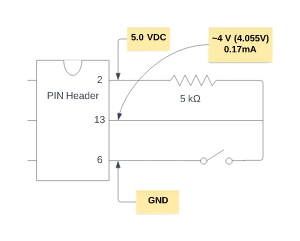

# Jetson AGX Xavier

## Pinout

- [JETSON AGX XAVIER J30 GPIO EXPANSION HEADER PINOUT](https://jetsonhacks.com/nvidia-jetson-agx-xavier-gpio-header-pinout/)
- [NVIDIA Jetson AGX Xavier Expansion Header](https://jetsonhacks.com/2018/11/07/nvidia-jetson-agx-xavier-expansion-header/)

[Configuring Jetson Expansion Header](https://docs.nvidia.com/jetson/archives/l4t-archived/l4t-3261/index.html#page/Tegra%20Linux%20Driver%20Package%20Development%20Guide/hw_setup_jetson_io.html#)

- "The configuration of all of the I/O pins on Jetson developer kits is statically defined, and is programmed into the device when it is flashed. To change the pin configuration directly, you must update a pinmux spreadsheet for your platform, then flash the new configuration to the Jetson device."

The following schematic shows how to make a pull-down circuit: when the button is pressed, the GPIO line's voltage is pulled down to Ground (0V). When the button is released, the voltage is raised up to High (~4V):

The following picture is an actual implementation of the pull-down circuit. The red line connects to a 5V pin; the grey line connects to a Ground pin; the yellow line connects to the pin that we want to pull up or down the voltage. This arrangement makes it easy to plug in and out the yellow line without getting interfered by the grey line.

## Device tree

[Device Tree Structure](https://docs.nvidia.com/drive/drive_os_5.1.6.1L/nvvib_docs/index.html#page/DRIVE_OS_Linux_SDK_Development_Guide/Utilities/util_device_tree.html)

