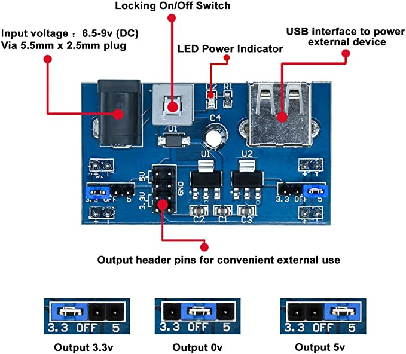
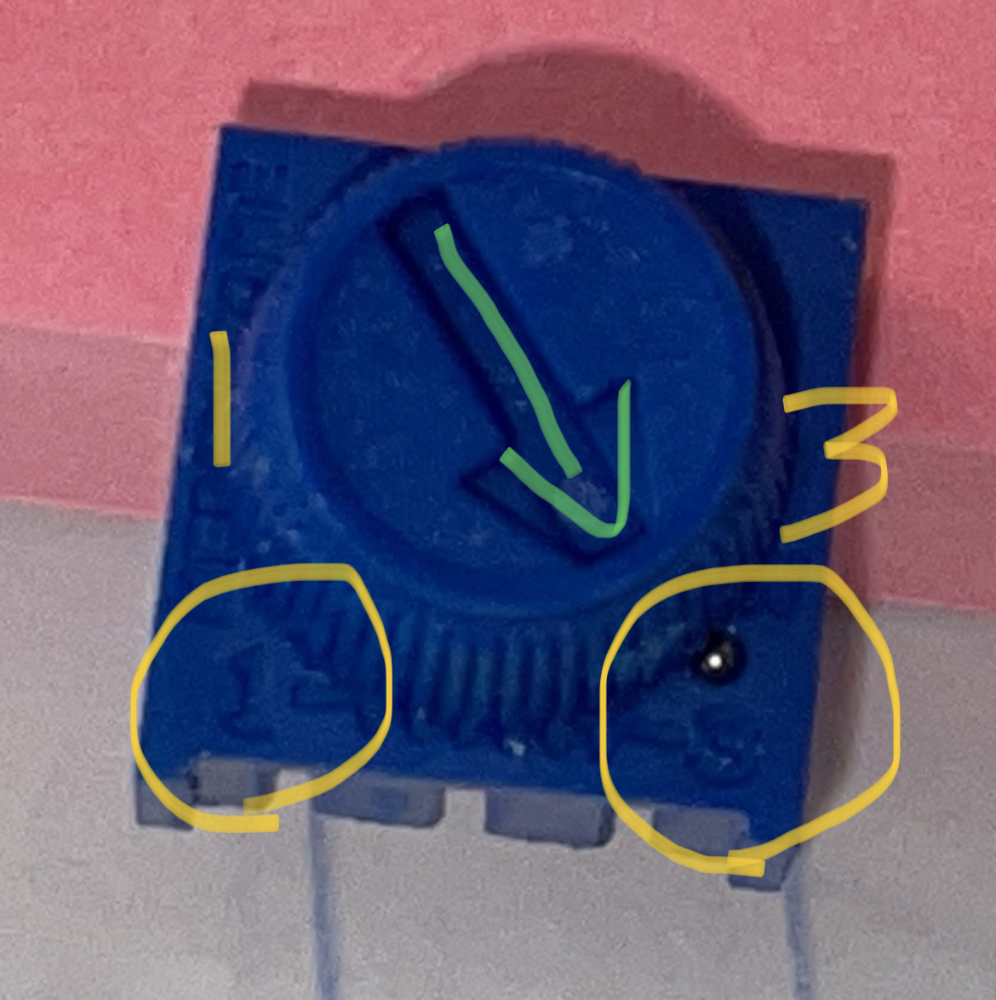

# RexQualis Fun Kit

## 1. Overview

The RexQualis fun kit I'm using is [this one](https://www.amazon.com/dp/B073ZC68QG). The instruments in this document are particularly for this kit.

## 2. Power Supply

The breadboard comes with a power supply that provides two modes: 5V DC and 3.3V DC. The following image shows how to adjust the output voltage:

## 3. Potentiometer

The potentiometer looks like the following image:

- Its resistance range is [0Ω, 10kΩ] according to my measurement. Note its maximum resistance is actually slightly smaller than 10kΩ.
- When the arrow points at position `3`, it is in the minimum resistance (0Ω).
- When the arrow points at position `1`, it is in the maximum resistance (10kΩ).
- Note that the relationships between the positions and the resistance are specific to the image above. I removed the rotating cap and re-installed it, and unfortunately I forgot whether I re-installed it in the original way. As a result, the original cap from the kit may look different from the image above. Make sure the arrow and the position numbers are in the correct relative positions before using the readings above.

## 4. LEDs

The forward voltage (`Vf`) of the LEDs are measured as follows (note some multimeters provide the function to measure LED's `Vf` so you don't have to build a circuit to measure it):

| Color | Vf |
|------:|:---|
| Red | 1.80V |
| Yellow | 1.85V |
| Green | 2.27V |
| Blue | 2.52V |
| White | 2.60V |
