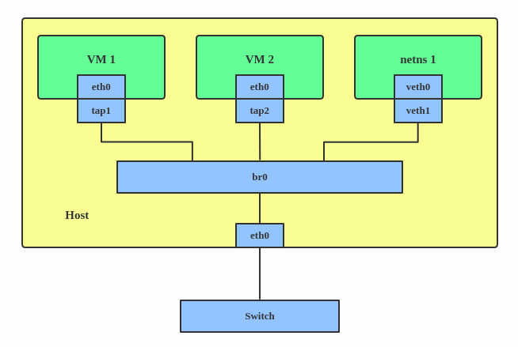
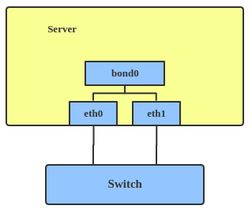
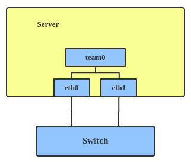
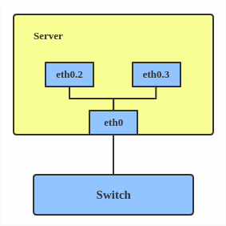
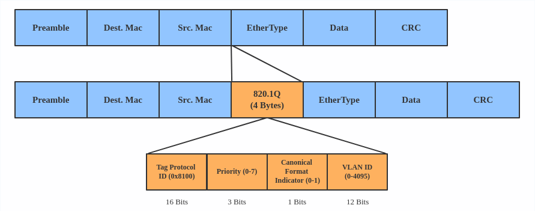

# Virtual Network Interfaces

## 1. Overview

This document is largely based on the article [Red Hat Developer: Introduction to Linux interfaces for virtual networking](https://developers.redhat.com/blog/2018/10/22/introduction-to-linux-interfaces-for-virtual-networking/). The knowledge may not be directly applicable to Ubuntu.

**Note** that the article talks about the virtual networking on a Linux system, not specifically for containers, so some of the virtual network interfaces can connect containers, virtual machines, and other processes. A more universal way to say it is "the virtual network interfaces" connect different **network namespaces.**

## 2. Common Interfaces

### 2.1 Bridge

Illustration:



Creation:

```shell
# ip link add br0 type bridge
# ip link set eth0 master br0
# ip link set tap1 master br0
# ip link set tap2 master br0
# ip link set veth1 master br0
```

Functionality:
- Forward packages among the interfaces that are connected to it.

Scope:
- Inside the host.
- Among different network namespaces.

When to Use:
- 

### 2.2 Bonded Interface

Illustration:



Creation:

```shell
# ip link add bond1 type bond miimon 100 mode active-backup
# ip link set eth0 master bond1
# ip link set eth1 master bond1
```

Functionality:
- Aggregate multiple network interfaces into a single logical one.
- In general, work in two modes:
  - hot standby
  - load balancer
- For more modes: [Linux Ethernet Bonding Driver HOWTO](https://www.kernel.org/doc/Documentation/networking/bonding.txt)

Scope:
- Inside the host.

When to Use:
- Want to increase link speed.
- Increase availability.

### 2.3 Team Device

Illustration:



Creation:

```shell
# teamd -o -n -U -d -t team0 -c '{"runner": {"name": "activebackup"},"link_watch": {"name": "ethtool"}}'
# ip link set eth0 down
# ip link set eth1 down
# teamdctl team0 port add eth0
# teamdctl team0 port add eth1
```

Functionality:
- Similar to a bonded interface but implemented in a different approach:
  - a lockless (RCU) TX/RX path
  - modular design
- See `3.1 Bonding vs. Team` for an in-depth comparison.

Scope:
- Inside the host.

When to Use:
- Use a team when you want to use some features that bonding doesn't provide.

References:
- [teamd(8)](http://manpages.ubuntu.com/manpages/bionic/man8/teamd.8.html)
- [teamdctl(8)](http://manpages.ubuntu.com/manpages/bionic/man8/teamdctl.8.html)
- The [`net_failover`](https://www.kernel.org/doc/html/latest/networking/net_failover.html) driver "provides an automated failover mechanism via APIs to create and destroy a failover master `netdev` and manages a primary and standby slave `netdev`s that get registered via the generic failover infrastructure."

### 2.4 VLAN (Virtual LAN)

Illustration:





Creation:

```shell
# ip link add link eth0 name eth0.2 type vlan id 2
# ip link add link eth0 name eth0.3 type vlan id 3
```

Functionality:
- Break the physical/geographical limitation of hosts so the hosts that are not in the physical LAN can work as if they were on the same LAN.
- Reduce the traffic congestion on a large LAN.

Scope:
- Across servers. If inside the same physical server, VLAN can be used across different VMs or containers.

When to Use:
- When re-cabling is too hard to do.
- When congestion reduction is needed for a large LAN.

References:
- The [AlliedWare Plus OS: Overview of VLANs (Virtual LANs)](./overview_vlans.pdf) is a good for understanding VLAN.
- This [SO answer](https://stackoverflow.com/a/8629725/630364) is a good supplement.

### 2.5 VXLAN (Virtual eXtensible LAN)

Illustration:


Creation:

```shell
# ip link add vx0 type vxlan id 100 local 1.1.1.1 remote 2.2.2.2 dev eth0 dstport 4789
```

Functionality:
- VXLAN is a tunneling protocol designed to solve the problem of limited VLAN IDs (4,096) in IEEE 802.1q.

Scope:
- The same as VLAN.

When to Use:
- When VLAN can't provide enough VLAN IDs.

References:
- [RFC 7348: Virtual eXtensible Local Area Network (VXLAN)](https://tools.ietf.org/html/rfc7348)
- [Kernel: Virtual eXtensible Local Area Networking documentation](https://www.kernel.org/doc/Documentation/networking/vxlan.txt)
- [VXLAN & Linux](https://vincent.bernat.ch/en/blog/2017-vxlan-linux)

## 3. Complementary Materials

### 3.1 Bonding vs. Team

[Bonding vs. Team features](https://github.com/jpirko/libteam/wiki/Bonding-vs.-Team-features)

<table>
<tr>
<th>Feature</th><th>Bonding</th><th>Team</th>
<tr>
    <td>broadcast TX policy</td>
    <td><div class="highlight"><strong class="nb"><em>Yes</em></strong></div></td>
    <td><div class="highlight"><strong class="nb"><em>Yes</em></strong></div></td>
</tr>
<tr>
  <td>round-robin TX policy</td>
  <td><div class="highlight"><strong class="nb"><em>Yes</em></strong></div></td>
  <td><div class="highlight"><strong class="nb"><em>Yes</em></strong></div></td>
</tr>
<tr>
  <td>active-backup TX policy</td>
  <td><div class="highlight"><strong class="nb"><em>Yes</em></strong></div></td>
  <td><div class="highlight"><strong class="nb"><em>Yes</em></strong></div></td>
</tr>
<tr>
  <td>LACP (802.3ad) support</td>
  <td><div class="highlight"><strong class="nb"><em>Yes</em></strong></div></td>
  <td><div class="highlight"><strong class="nb"><em>Yes</em></strong></div></td>
</tr>
<tr>
  <td>Hash-based TX policy</td>
  <td><div class="highlight"><strong class="nb"><em>Yes</em></strong></div></td>
  <td><div class="highlight"><strong class="nb"><em>Yes</em></strong></div></td>
</tr>
<tr>
  <td>Highly customizable hash function setup</td>
  <td><em>No</em></td>
  <td><div class="highlight"><strong class="nb"><em>Yes</em></strong></div></td>
</tr>
<tr>
  <td>TX load-balancing support (TLB)</td>
  <td><div class="highlight"><strong class="nb"><em>Yes</em></strong></div></td>
  <td><div class="highlight"><strong class="nb"><em>Yes</em></strong></div></td>
</tr>
<tr>
  <td>RX load-balancing support (ALB)</td>
  <td><div class="highlight"><strong class="nb"><em>Yes</em></strong></div></td>
  <td>Planned</td>
</tr>
<tr>
  <td>RX load-balancing support (ALB) in bridge or openvswitch</td>
  <td><em>No</em></td>
  <td>Planned</td>
</tr>
<tr>
  <td>LACP hash port select</td>
  <td><div class="highlight"><strong class="nb"><em>Yes</em></strong></div></td>
  <td><div class="highlight"><strong class="nb"><em>Yes</em></strong></div></td>
</tr>
<tr>
  <td>load-balancing for LACP support</td>
  <td><em>No</em></td>
  <td><div class="highlight"><strong class="nb"><em>Yes</em></strong></div></td>
</tr>
<tr>
  <td>Ethtool link monitoring</td>
  <td><div class="highlight"><strong class="nb"><em>Yes</em></strong></div></td>
  <td><div class="highlight"><strong class="nb"><em>Yes</em></strong></div></td>
</tr>
<tr>
  <td>ARP link monitoring</td>
  <td><div class="highlight"><strong class="nb"><em>Yes</em></strong></div></td>
  <td><div class="highlight"><strong class="nb"><em>Yes</em></strong></div></td>
</tr>
<tr>
  <td>NS/NA (IPV6) link monitoring</td>
  <td><em>No</em></td>
  <td><div class="highlight"><strong class="nb"><em>Yes</em></strong></div></td>
</tr>
<tr>
  <td>ports up/down delays</td>
  <td><div class="highlight"><strong class="nb"><em>Yes</em></strong></div></td>
  <td><div class="highlight"><strong class="nb"><em>Yes</em></strong></div></td>
</tr>
<tr>
  <td>port priorities and stickiness ("primary" option enhancement)</td>
  <td><em>No</em></td>
  <td><div class="highlight"><strong class="nb"><em>Yes</em></strong></div></td>
</tr>
<tr>
  <td>separate per-port link monitoring setup</td>
  <td><em>No</em></td>
  <td><div class="highlight"><strong class="nb"><em>Yes</em></strong></div></td>
</tr>
<tr>
  <td>multiple link monitoring setup</td>
  <td><span style="color: orange"><em>Limited</em></span></td>
  <td><div class="highlight"><strong class="nb"><em>Yes</em></strong></div></td>
</tr>
<tr>
  <td>lockless TX/RX path</td>
  <td><em>No</em>(rwlock)</td>
  <td><div class="highlight"><strong class="nb"><em>Yes</em></strong></div>(RCU)
</td>
</tr>
<tr>
  <td>VLAN support</td>
  <td><div class="highlight"><strong class="nb"><em>Yes</em></strong></div></td>
  <td><div class="highlight"><strong class="nb"><em>Yes</em></strong></div></td>
</tr>
<tr>
  <td>user-space runtime control</td>
  <td><span style="color: orange"><em>Limited</em></span></td>
  <td><span style="color: green"><em>Full</em></span>
</td>
</tr>
<tr>
  <td>Logic in user-space</td>
  <td><em>No</em></td>
  <td><div class="highlight"><strong class="nb"><em>Yes</em></strong></div></td>
</tr>
<tr>
  <td>Extensibility</td>
  <td><span style="color: red"><em>Hard</em></span></td>
  <td><span style="color: green"><em>Easy</em></span>
</td>
</tr>
<tr>
  <td>Modular design</td>
  <td><em>No</em></td>
  <td><div class="highlight"><strong class="nb"><em>Yes</em></strong></div></td>
</tr>
<tr>
  <td>Performance overhead</td>
  <td><span style="color: orange"><em>Low</em></span></td>
  <td><span style="color: green"><em>Very Low</em></span>
</td>
</tr>
<tr>
  <td>D-Bus interface</td>
  <td><em>No</em></td>
  <td><div class="highlight"><strong class="nb"><em>Yes</em></strong></div></td>
</tr>
<tr>
  <td>ØMQ interface</td>
  <td><em>No</em></td>
  <td><div class="highlight"><strong class="nb"><em>Yes</em></strong></div></td>
</tr>
<tr>
  <td>multiple device stacking</td>
  <td><div class="highlight"><strong class="nb"><em>Yes</em></strong></div></td>
  <td><div class="highlight"><strong class="nb"><em>Yes</em></strong></div></td>
</tr>
<tr>
  <td>zero config using LLDP</td>
  <td><em>No</em></td>
  <td>Planned</td>
</tr>
</table>
