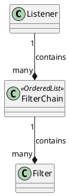

# Use PlantUML in Markdown Documents

## Overview

Setup:
- Install `plantuml` extension.
- Configure `plantuml.server` (can use the official server `https://www.plantuml.com/plantuml` if the diagrams don't contain confidential information).

## Examples

In the markdown documents, use the following syntax to write a built-in UML diagram and press `Ctrl-V` to preview the result:

