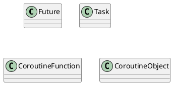

# asyncio

Documents:
- [Python 3.6: 18.5. asyncio — Asynchronous I/O, event loop, coroutines and tasks](https://docs.python.org/3.6/library/asyncio.html)

> Note that tasks are futures, and everything said about futures also applies to tasks.

[Example: Chain coroutines](https://docs.python.org/3.6/library/asyncio-task.html#example-chain-coroutines) is a good example:

