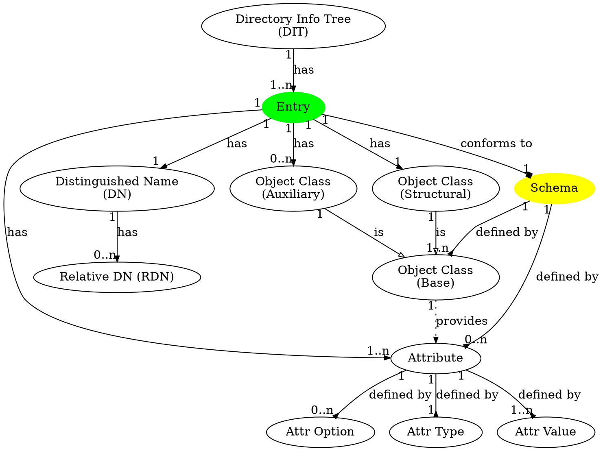

# LDAP

## Overview

This article is the notes I took when learning LDAP (Lightweight Directory Access Protocol) of version 3 (`LDAPv3`). I used [2] as my primary learning source but also refered to [1] for better understanding of some specific topics.

Technically, LDAP is a communication protocol and is not about how the data is stored. However, LDAP's conceptual models somewhat reflects how the data is perceived, even if the underlying data can be stored in a completely different structure and is transformed to the expected structure when being accessed. So when I'm talking about the data storage in this article, I'm merely talking about the perceived models of storing the data.

Some concepts that are used in file systems, object-oriented programming (OOP), and domain names are helpful to better understand LDAP.

## Directory Services

What is a "directory service"? According to [2]:

> A directory service is the collection of software and processes that store information about your enterprise, subscribers, or both. An example of a directory service is the Domain Name System (DNS), which is provided by DNS servers. A DNS server stores the mappings of computer host names and other forms of domain name to IP addresses. A DNS client sends questions to a DNS server about these mappings (e.g. what is the IP address of test.example.com?). Thus, all of the computing resources (hosts) become clients of the DNS server. The mapping of host names enables users of the computing resources to locate computers on a network, using host names rather than complex numerical IP addresses.

[3] defines it as follows:

> In computing, a directory service or name service maps the names of network resources to their respective network addresses. It is a shared information infrastructure for locating, managing, administering and organizing everyday items and network resources, which can include volumes, folders, files, printers, users, groups, devices, telephone numbers and other objects. A directory service is a critical component of a network operating system. A directory server or name server is a server which provides such a service. Each resource on the network is considered an object by the directory server. Information about a particular resource is stored as a collection of attributes associated with that resource or object.

After reading various sources about its definition, I find people commonly recognize the following characteristics of a directory service:
- It is **a central service in a network that provides information about the other resources in the same network**.
  - For example, the DNS service for a network which all the hosts can query to find the information (addresses in this case) of any other hosts. 
  - Another example is the [CORBA name service](https://docs.oracle.com/cd/E13211_01/wle/naming/over.htm) which all the services query to get the addresses of any other services.
- Its data is supposed to be **read more frequently than it is written**. Therefore, it is tuned to respond quickly to high-volume lookup or search operations.
  - The data surely can be updated, but usually is updated as frequently as the resources are. Take the DNS service as an example. The host information that the DNS service maintains doesn't need to be updated as long as the network remains stable. It only needs to be updated when the network topology is changed, which should not happen that frequently in real uses.
- Although a "directory" is said to be similar to a database, they have fundamental differences. A directory typically arranges the information in a hierarchical structure, similar to a file system, while a relational database arranges the information in the form of 2D tables. A directory doesn't not necessarily support transactions or roll-backs, but a database typically supports them.

## Server and Client

Directories are usually accessed using the **client/server model** of communication. LDAP is the communication protocol between an LDAP server and an LDAP client.

The client is not dependent upon a particular implementation of the server; the server can implement the directory however it chooses.

## Domain Model

[1.1] says LDAP defines 4 types of models:
- Directory User Information (e.g., **information provided and administrated by users**, not about users)
- Directory Administrative and Operational Information (e.g., **information used to administer and/or operate the directory**)
- Directory Schema
- DSA (Server) Informational Model

I created the following is the domain model after reading [2] with the help of [1.2]:

An `entry` is similar to a folder or a file in a file system. You may see the terms such as "directory entry" or "object entry", but they don't matter that much. In a file system, a folder is usually not the leaf node in the hierarchy, sp an `entry` doesn't have to be a leaf node in the DIT. Figure 2-2 in [2] illustrates this.

## RFCs

As of 2021-01-04, [1] serves as the "meta spec" in order to find all the related LDAP RFCs.

## References

- [1] [RFC 4510: Lightweight Directory Access Protocol (LDAP): Technical Specification Road Map](https://tools.ietf.org/html/rfc4510)
  - [1.1] [RFC 4511: Lightweight Directory Access Protocol (LDAP): The Protocol](https://tools.ietf.org/html/rfc4511)
  - [1.2] [RFC 4512: Lightweight Directory Access Protocol (LDAP): Directory Information Models](https://tools.ietf.org/html/rfc4512)
- [2] [IBM: Understanding LDAP - Design and Implementation](http://www.redbooks.ibm.com/abstracts/sg244986.html)
- [3] [Sun Java(TM) System Directory Server 5.2 2005Q1 Technical Overview: Chapter 2 - Introduction to Directory Services and Directory Server](https://docs.oracle.com/cd/E19901-01/817-7619/intro.html)
- [4] [Wikipedia: Directory service](https://en.wikipedia.org/wiki/Directory_service)
- [5] [Understanding the LDAP Protocol, Data Hierarchy, and Entry Components](https://www.digitalocean.com/community/tutorials/understanding-the-ldap-protocol-data-hierarchy-and-entry-components)
- [6] [LDAP.com](https://ldap.com/)
- [7] [LDAP Wiki](https://ldapwiki.com/wiki/Main)
